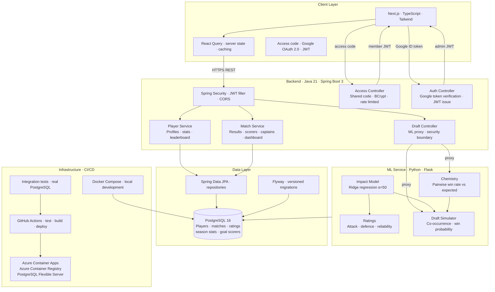

# MNF Manager — System Architecture

## System diagram

## Key design decisions

**Flyway over Hibernate auto-DDL** — every schema change is a versioned migration file. Safe for production, auditable, and reversible.

**A shared access code rather than per-player accounts** — the app holds real people's match records, so it isn't public. Individual accounts would mean collecting email addresses from thirty people for a hobby project. Instead there is one BCrypt-hashed code, shared with the group and exchanged for a 30-day member JWT. Less personal data collected, and closer to how the group already works.

**Ratings hidden server-side, not client-side** — ratings are stripped from API responses for non-admins rather than hidden in the UI, so they can't be read from the raw JSON. On the `Player` entity this is done with a custom Jackson serializer rather than nulling the field, because `Player.rating` uses `orphanRemoval`: setting it to null inside a transaction would delete the rating row.

**Secrets from the environment, not the image** — the backend originally read secrets from a gitignored `application-secrets.yml` baked into the image. That works when building locally, but a CI-built image would never have the file and would silently fall back to defaults, including a publicly known JWT secret. Production now reads everything from Azure Container App secrets, and a `.dockerignore` keeps the file out of images entirely.

**ML service behind a Spring Boot proxy** — the frontend never calls the Python service directly, and the ML service has internal ingress only, so it isn't reachable from the internet at all. All ML endpoints are proxied through `DraftController`, which puts the security boundary at the Spring layer where the access rules already live.

**Ridge regression over subjective ratings** — an adjusted plus-minus style impact model controls for teammate quality. A player's attack rating reflects their contribution to goals scored after accounting for who else was on the pitch. Minimum ten appearances; below that, no rating, because a null is more honest than a floor value.

**A centred rating scale rather than min-max** — min-max scaling meant one player's unusual result rescaled everyone else's rating, and it exaggerated differences the data couldn't support. Ratings are now centred on the group average, with each standard deviation of impact moving a rating by a fixed amount.

**Points percentage over win rate** — (W×3 + D) / (MP×3) × 100 rewards draws appropriately and matches the football points system the players already understand.

**Set over List for JPA collections** — Hibernate's `MultipleBagFetchException` is avoided by using `Set` for all `OneToMany` relationships, allowing multiple simultaneous `JOIN FETCH` operations without cartesian product issues.

**Stateless JWT authentication** — no server-side session state. The access code and Google OAuth both exchange for a signed JWT carrying a role, sent via an Axios interceptor on every request. Admin access is controlled by an email list supplied through the environment.

**Chemistry and ratings caching** — the impact model, ratings and pairwise chemistry each cache their results in module-level variables, with a `force_refresh` parameter so the weekly ratings update can bust the cache without restarting the service. Worth noting this caused a three-day outage of match prediction: `force_refresh` was referenced in the cache check before it existed as a parameter, so every call after the first raised a `NameError`. Because the Flask route caught the exception and returned a generic 500, nothing surfaced in the logs.

## Known limitations

**The ratings model measures impact, not ability.** With a squad of around thirty and teams picked by captains in alternating order, players picked late tend to share teammates. The regression struggles to separate an individual's contribution from their team's. Opposition strength isn't yet in the model, and rating uncertainty isn't surfaced to the reader. Both are the current focus.

**The database allows connections from Azure services** rather than sitting behind a private endpoint, which would require rebuilding the Container Apps environment with VNet integration. Given non-sensitive data, a rotated password and enforced TLS, this was a deliberate trade-off rather than an oversight.

**The ML service runs Flask's development server.** Fine for the traffic this sees, but gunicorn would be correct for production.
