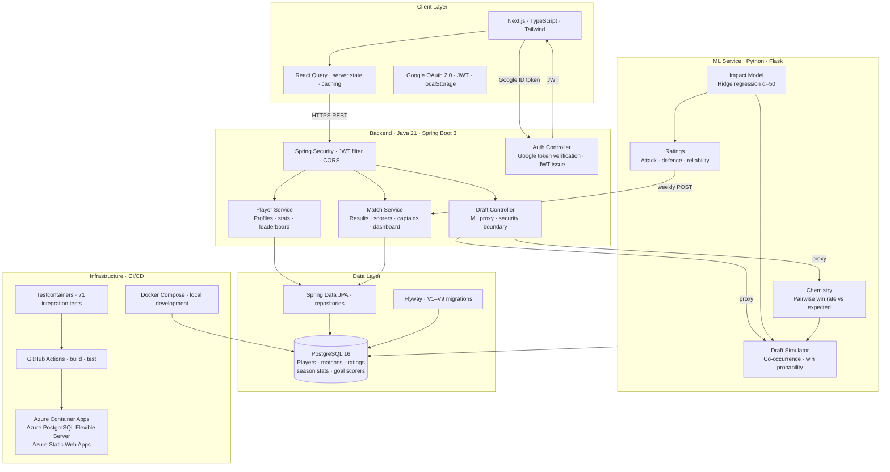

# MNF Manager — System Architecture

## System Diagram

## Key Design Decisions

**Flyway over Hibernate auto-DDL** — every schema change is a versioned migration file (V1–V9). Safe for production, auditable, and reversible.

**ML service behind Spring Boot proxy** — the frontend never calls the Python service directly. All ML endpoints are proxied through `DraftController`, keeping the security boundary at the Spring layer and preventing unauthenticated access to the model.

**Ridge regression over subjective ratings** — adjusted plus-minus style impact model controls for teammate quality. A player's attack rating reflects their contribution to goals scored after accounting for who else was on the pitch. Minimum 10 appearances threshold — null is more honest than a floor value.

**Points percentage over win rate** — (W×3 + D) / (MP×3) × 100 rewards draws appropriately and matches the football points system the players already understand.

**Set over List for JPA collections** — Hibernate's MultipleBagFetchException is avoided by using Set for all OneToMany relationships, allowing multiple simultaneous JOIN FETCH operations without cartesian product issues.

**Stateless JWT authentication** — no server-side session state. Google OAuth exchanges an ID token for a signed JWT; the JWT is stored in localStorage and sent via Axios interceptor on every request. Admin access is controlled by an email whitelist in application-secrets.yml.

**Chemistry caching** — pairwise chemistry, impact model, and ratings all cache their results in module-level variables. A `force_refresh` parameter allows the weekly ratings update to bust the cache without restarting the service.