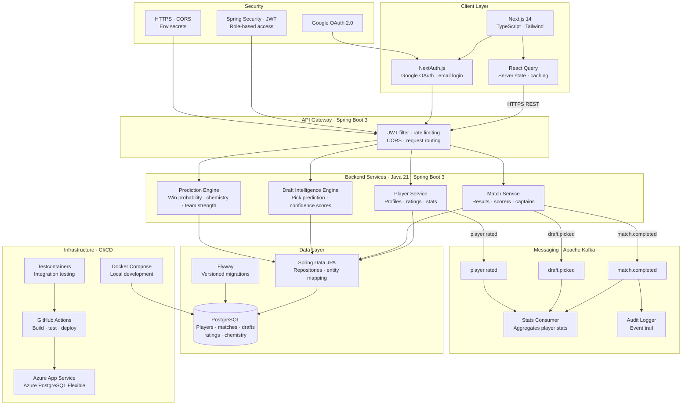

# MNF Manager — System Architecture

Designed before development began as the blueprint for the full system.

## System Diagram

## Key Design Decisions

**Flyway over Hibernate auto-DDL** — every schema change is a versioned migration file. Safe for production, auditable, and reversible.

**Reliability as a first-class metric** — player ratings are deliberately simplified to three scores: ability, reliability, and goal threat. Complex subjective attributes were rejected in favour of fewer, more honest data points. Reliability is hypothesised to be more predictive of match outcomes than raw ability scores alone.

**Kafka from day one** — event-driven architecture is not a v2 addition. Match and draft events flow through Kafka from the first match recorded, giving the system an audit trail and enabling decoupled consumers from the start.

**Set over List for JPA collections** — Hibernate's MultipleBagFetchException is avoided by using Set for all OneToMany relationships, allowing multiple simultaneous JOIN FETCH operations without cartesian product issues.

**Simplified ratings model** — a deliberate decision to avoid FIFA-style multi-attribute complexity. Three meaningful scores per player rather than ten subjective ones means the data is actually filled in accurately and consistently.
