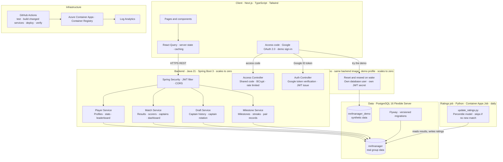

# MNF Manager — System Architecture

## System diagram

```mermaid
graph TD
    subgraph Client["Client · Next.js · TypeScript · Tailwind"]
        FE["Pages and components"]
        RQ["React Query · server state · caching"]
        AUTH["Access code · Google OAuth 2.0 · demo sign-in"]
    end

    subgraph Backend["Backend · Java 21 · Spring Boot 3 · scales to zero"]
        SEC["Spring Security · JWT filter · CORS"]
        ACC["Access Controller\nShared code · BCrypt · rate limited"]
        AC["Auth Controller\nGoogle token verification · JWT issue"]
        PS["Player Service\nProfiles · stats · leaderboard"]
        MS["Match Service\nResults · scorers · captains · dashboard"]
        DS["Draft Service\nCaptain history · captain rotation"]
        MIL["Milestone Service\nMilestones · streaks · pair records"]
    end

    subgraph Job["Ratings job · Python · Container Apps Job · daily"]
        RJ["update_ratings.py\nPercentile model · skips if no new match"]
    end

    subgraph Demo["Demo · same backend image · demo profile · scales to zero"]
        DEMO["Reset and reseed on wake\nOwn database user · own JWT secret"]
    end

    subgraph Data["Data · PostgreSQL 16 Flexible Server"]
        DB[("mnfmanager\nreal group data")]
        DEMODB[("mnfmanager_demo\nsynthetic data")]
        FW["Flyway · versioned migrations"]
    end

    subgraph Infra["Infrastructure"]
        GA["GitHub Actions\ntest · build changed services · deploy · verify"]
        AZ["Azure Container Apps · Container Registry"]
        LA["Log Analytics"]
    end

    FE --> RQ
    RQ -->|HTTPS REST| SEC
    AUTH -->|access code| ACC
    AUTH -->|Google ID token| AC
    AUTH -->|try the demo| DEMO

    SEC --> PS
    SEC --> MS
    SEC --> DS
    SEC --> MIL

    PS --> DB
    MS --> DB
    DS --> DB
    MIL --> DB
    FW --> DB
    RJ -->|reads results, writes ratings| DB
    DEMO --> DEMODB

    GA --> AZ
    AZ --> LA
```

## Key design decisions

**Flyway over Hibernate auto-DDL.** Every schema change is a versioned migration
file, so production schema history is explicit and auditable. Tests rebuild the
schema from the migrations on every run, so a migration that fails on a fresh
database fails the build rather than a deploy.

**A shared access code rather than per-player accounts.** The app holds real
people's match records, so it isn't public. Individual accounts would mean
collecting email addresses from thirty people for a hobby project. Instead there
is one BCrypt-hashed code, shared with the group and exchanged for a 30-day member
JWT. Less personal data collected, and closer to how the group already works.

**Ratings hidden server-side, not client-side.** Ratings are stripped from API
responses for non-admins rather than hidden in the UI, so they can't be read from
the raw JSON. On the `Player` entity this is done with a custom Jackson serializer
rather than nulling the field, because `Player.rating` uses `orphanRemoval`:
setting it to null inside a transaction would delete the rating row.

**Secrets from the environment, not the image.** The backend originally read
secrets from a gitignored `application-secrets.yml` baked into the image. A
CI-built image would never have the file and would silently fall back to defaults,
including a publicly known JWT secret. Production reads everything from Container
App secrets, and `.dockerignore` keeps the file out of images entirely.

**Evaluate before trusting a model.** The first version predicted match results
with a ridge-regression player model. An evaluation harness that trains on past
weeks and predicts the next found it no better than chance, and a permutation
test found pair "chemistry" indistinguishable from luck. Both features were
removed. The ratings that replaced them are a transparent percentile model: no
better at prediction, since nothing is, but as stable and explainable to the
people it rates.

**No always-on ML service.** Once prediction went, the Python service only ran SQL
queries for the draft simulator and a weekly ratings script. The queries moved
into the backend, and ratings became a Container Apps Job that runs daily and only
recalculates when a match has been recorded since the last run. Running twice for
one match night would compare ratings against themselves and zero the deltas.

**Scale to zero where a wait is acceptable.** The backend and demo scale to zero;
the frontend stays on at a quarter of a CPU, so the public pages always load
instantly. The first request after a quiet spell waits 20–30 seconds. For a group
that meets once a week, that trade cut running costs to a fraction.

**A self-resetting demo, isolated by construction.** The demo is the same backend
image under a `demo` profile, with its own database, its own database user and its
own JWT secret. It wipes and reseeds its database every time it starts, so each
visitor after a quiet spell gets a fresh sandbox with full admin access. It
refuses to start unless its database name ends in `_demo`, the demo user can't
connect to the real database, and demo tokens are rejected by the real backend.

**Milestones as a pure calculator.** Streak and milestone rules live in a class
with no Spring or database dependency, unit tested against made-up match
histories. The service only loads history through two projection queries and
hands it over.

**Points percentage over win rate.** (W×3 + D) / (MP×3) × 100 rewards draws
appropriately and matches the football points system the players already
understand.

**Avoiding multiple bag fetches.** `Player`'s collections are `Set`s. `Match` uses
`List`s, so its collections are never fetched together in one query: match detail
loads players and scorers in separate queries, and read-heavy features use
projection queries instead of loading entities.

**Stateless JWT authentication.** No server-side session state. The access code,
Google OAuth and the demo all exchange for a signed JWT carrying a role, sent by an
Axios interceptor on every request. Admin access is controlled by an email list
supplied through the environment.

## Lessons from production

**Silent failures are the expensive ones.** Match prediction was down for three
days because a cache check referenced a parameter before it existed, and the Flask
route turned the `NameError` into a generic 500 that never reached the logs.

**A test setup can hide the bug it should catch.** Tests once used Hibernate's
`create-drop`, so Hibernate rebuilt the schema each run and the migrations were
never exercised. That masked a migration which failed on a fresh database.

**`.gitignore` rules need anchors.** An unanchored `db/` rule, meant for a local
database dump, also matched `src/main/resources/db/`, so new migrations were
silently never committed. A `data/` rule did the same to the ML service's loader
package. Both are now anchored to the paths they were meant for.

## Known limitations

**Ratings describe recorded results, not ability.** A good night on a losing team
doesn't show up, and ratings are relative within a position group, so they can
move after a match a player won or didn't play in.

**Positional balance is coarse.** The draft's balance check counts defence,
midfield and attack, so a side with three full-backs and no centre-back reads as
balanced.

**The database accepts connections from Azure services** rather than sitting
behind a private endpoint, which would require rebuilding the Container Apps
environment with VNet integration. With enforced TLS, a rotated password and a
separate least-privilege user for the demo, this was a deliberate trade-off.

**Rate limiting is per replica.** Access-code attempts are counted in memory, which
holds while the backend runs a single replica, and resets when it scales to zero.
